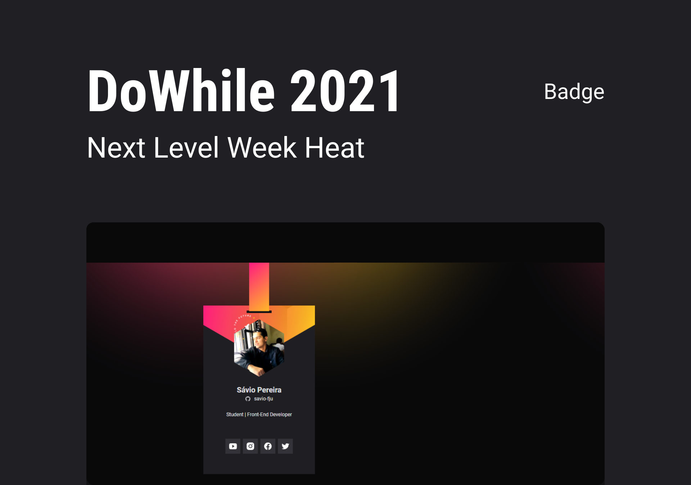

<h1 align="center">
  
</h1>

  <a href="#-tecnologias">Tecnologias</a>&nbsp;&nbsp;&nbsp;|&nbsp;&nbsp;&nbsp;
  <a href="#-projeto">Projeto</a>&nbsp;&nbsp;&nbsp;|&nbsp;&nbsp;&nbsp;
  <a href="#-layout">Layout</a>&nbsp;&nbsp;&nbsp;|&nbsp;&nbsp;&nbsp;
  <a href="#-contribuição">Contribuição</a>

<!-- 

 
  

 -->

 

  

## 🚀 Tecnologias

Esse projeto foi desenvolvido com as seguintes tecnologias:

- HTML
- CSS
- JavaScript
 
## 💻 Projeto

Card de embarque para o evento DoWhile 2021 da empresa Rocketseat.

## 🔖 Layout

Você pode visualizar o layout do projeto através [desse link](https://www.figma.com/file/j6HpvuH1Vx2jwzvpikYw7D/%5BNLW-Heat---Mission%3A-Origin%5D-DoWhile2021-(Community)?node-id=61385%3A101). É necessário ter conta no [Figma](https://figma.com) para acessá-lo.

<!-- ## :memo: Licença 

Esse projeto está sob a licença MIT. Veja o arquivo [LICENSE](.github/LICENSE.md) para mais detalhes. -->

## 🤝 Contribuição

Contribuições são o que fazem pessoas evoluirem e incentivam a melhorar, inspirar e criar. Qualquer contribuição que você fizer será **muito apreciada**.

1. Faça um Fork do projeto
2. Crie uma Branch para sua Feature (`git checkout -b feature/FeatureIncrivel`)
3. Adicione suas mudanças (`git add .`)
4. Comite suas mudanças (`git commit -m 'Adicionando uma Feature incrível!`)
5. Faça o Push da Branch (`git push origin feature/FeatureIncrivel`)
6. Abra uma Pull Request

<!-- CONTACT -->
---
## Contato

Feito com ♥ by Sávio de Paula - [Github](thub.com/savio-fju) - **saviofju@gmail.com**

